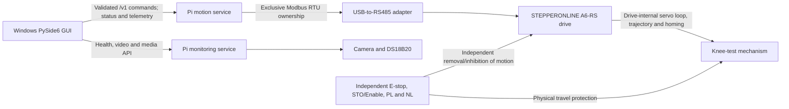

# Architecture

## System overview

The system separates operator presentation, motion control, monitoring, drive behavior,
and safety. Windows has no serial capability in the application architecture.

## Component boundaries

### Windows PySide6 GUI

The GUI presents operator controls and status, validates input for usability, obtains a
single-controller lease, and calls high-level network operations. The Pi repeats all
safety-relevant validation and authorization. The GUI never imports a servo transport,
opens serial, or exposes register addresses.

### Raspberry Pi motion service

The motion service is the only process allowed to own the USB-to-RS485 device. It validates
commands, authorizes state transitions, maintains command idempotency and the control
lease, drives the allowlisted A6-RS workflow, and publishes motion state and telemetry.
Milestone 1 implements only a synchronous simulation core, deterministic fake servo, and
framework-free contracts. It contains no network server or real drive transport.

### Raspberry Pi monitoring service

The monitoring service independently owns camera, video, recordings, file management,
DS18B20 temperature, and Pi-health reporting. It must not import or call the servo
transport. It may report information to the GUI but cannot enable, home, stop, or move the
servo.

### A6-RS drive and RS485 adapter

The adapter transports Modbus RTU only for the motion service. The drive performs encoder
processing, its servo loop, acceleration/deceleration, position trajectories, and internal
homing. Python configures and triggers reviewed drive functions and verifies feedback; it
does not synthesize homing through repeated Jog commands.

### Independent hardware safety system

The E-stop, STO or Servo Enable removal, and PL/NL limits operate independently of both
computers, all software, networking, and RS485. Software limits and controlled-stop
commands are supplementary and not safety-rated.

## State ownership

The motion service is authoritative for five explicit dimensions:

| Dimension | States |
|---|---|
| Service | `STARTING`, `READY`, `DEGRADED`, `FAULT`, `STOPPING`, `STOPPED` |
| Connection | `DISCONNECTED`, `CONNECTING`, `CONNECTED`, `COMMUNICATION_FAULT` |
| Servo | `SERVO_DISABLED`, `SERVO_ENABLING`, `SERVO_ENABLED`, `SERVO_DISABLING`, `SERVO_FAULT` |
| Homing | `UNHOMED`, `HOMING`, `HOMED`, `HOMING_FAULT` |
| Motion | `IDLE`, `STARTING`, `MOVING`, `PAUSED`, `STOPPING`, `MOTION_FAULT` |

Pi startup begins disconnected, `SERVO_DISABLED`, `UNHOMED`, and `IDLE`. The
simulation preserves the same safe startup and advances only by explicit ticks. Future
real transitions must depend on confirmed feedback, not request acceptance or fixed
sleeps.

## Failure isolation and required behavior

| Event | Required behavior |
|---|---|
| Windows GUI disconnects while idle | Revoke or expire the lease, accept read-only queries, and never enable, home, or start motion. |
| GUI lease expires during motion | Request a controlled stop if communication permits, reject further motion, enter `FAULT`, and require explicit recovery. Do not automatically issue Servo Off. |
| Motion service fails | No other process takes RS485 ownership. Any restart begins disabled, unhomed, idle, and without restoring a task. Hardware safety remains independent. |
| Monitoring service fails | Motion service remains isolated and running; failure cannot issue a motion command or trigger recovery. |
| Raspberry Pi restarts | Do not restore leases or tasks. Start `SERVO_DISABLED`, `UNHOMED`, and nonmoving. |
| RS485 disconnects | Stop issuing commands, enter connection `COMMUNICATION_FAULT` and service `FAULT`, invalidate interrupted work, and require deliberate recovery after communication returns. |
| Servo alarm occurs | Enter `FAULT`, block motion, retain alarm evidence, and require explicit reset and state reauthorization. |

No watchdog may restart or resume a previous motion task. A network heartbeat is a service
health mechanism only and is never a hardware E-stop.
