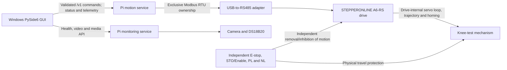

# Architecture

## System overview

The system separates operator presentation, motion control, monitoring, drive behavior,
and safety. Windows has no serial capability in the application architecture. The diagram
below is the intended distributed architecture, not an installed hardware connection.
Through Milestone 7, the application path remains in-process simulation. A separate,
manually invoked Raspberry Pi diagnostic can perform one explicitly armed symbolic read;
it is unreachable from GUI and service startup.



## Component boundaries

### Windows PySide6 GUI

The GUI presents operator controls and status, validates input for usability, obtains a
single-controller lease, and calls high-level `MotionClient` operations. A future Pi
service will repeat all safety-relevant validation and authorization behind a network
adapter. The GUI never imports a servo transport, opens serial, or exposes register
addresses.

In Milestone 2, no network operation exists. The concrete flow is entirely in-process:

```text
PySide6 GUI -> MotionClient -> InProcessSimulationClient
            -> MotionCoordinator -> FakeServo
```

Only the in-process adapter knows the coordinator and fake servo. Main-window logic uses
the high-level client contract so a later network implementation need not change operator
presentation or weaken command-side authorization.

### Transport-free register boundary

Milestone 3 adds only a pure future-driver sublayer:

```text
Future Pi Modbus transport (not implemented)
    -> explicit register codec and immutable catalog
    -> typed raw values
```

The codec accepts and returns ordinary Python integers. It does not know about Modbus
functions, device offsets, serial ports, MinimalModbus, pyserial, the Pi, networking, or
Qt. Catalog membership is documentary evidence, not permission to read or write a drive.
Any future transport remains exclusively inside the Pi motion service and must supply an
explicit layout verified for the exact hardware before claiming trusted 32-bit telemetry.
Uninterpreted raw acquisition has a separate evidence and authorization gate; it must not
silently select a hardware layout.

### Read-only boundaries (Milestones 4 and 7)

```text
Offline flow:
ReadOnlyServoReader -> ReadOnlyRegisterTransport -> FakeReadOnlyTransport -> synthetic words
ReadOnlyServoReader -> immutable catalog and codec -> typed results / partial snapshots

Manual Pi diagnostic flow:
symbolic CLI -> fixed three-register allowlist -> one FC03 RTU request -> raw result -> close
```

The general reader remains transport-independent and accepts only symbolic catalog names.
Milestone 7's separate diagnostic implements enough RTU framing for one FC03/U16 request
to `SERVO_STATUS`, `PLAN_OPERATION_GROUP`, or `DI_STATUS`. The address is immutable
catalog data; the CLI has no numeric-address option. It requires a configured
`/dev/serial/by-id/...` path, verifies Raspberry Pi identity before opening, makes no
retry, scan, poll, reconnect, or write, records request/response bytes and UTC/monotonic
timing, and closes the port in all outcomes. `validate-config` builds and reports the
request without opening a device.

The reader requires an explicit `OfflineFixtureInterpretation`, rejects unauthorized
reads before transport calls, and has no retry, polling, cache, thread, GUI, or motion
authorization coupling. Snapshots are bounded single-pass reads, not atomic drive samples.
Injected clocks supply acquisition times. No reader is connected to the GUI.

### Evidence boundary (Milestone 5)

The [evidence matrix](evidence-matrix.md) preserves documentary provenance separately from
physical verification. [Readiness gates](hardware-readiness.md) distinguish tested offline
code (A PASS), conditionally prepared real raw acquisition (B), trusted typed telemetry
(C BLOCKED), and motion (D BLOCKED). No raw response, fixture, manual default or successful connection can
authorize servo enablement or motion. The [commissioning design](read-only-commissioning.md)
defines future bounded, separately authorized observations only; there is no concrete
adapter, serial/device discovery, hardware test or service implementation from this audit.

Milestone 6 adds A6-RS family evidence for FC03, parameter group/offset addressing,
high-byte-first 16-bit words, CRC framing, and selectable 32-bit word order. The parameter
manual identifies `U40.04`, `U41.08`, and `U41.0A` as read-only U16 values, making those
three sufficient for the narrow Milestone 7 diagnostic. This documentary mapping does
not verify installed identity, firmware, wiring, settings, input polarity, or current
state. Historical LabVIEW success supports prior RS485 operation but supplies no current
Pi raw capture. Gates C and D remain blocked.

### Raspberry Pi motion service

The motion service is the only process allowed to own the USB-to-RS485 device. It validates
commands, authorizes state transitions, maintains command idempotency and the control
lease, drives the allowlisted A6-RS workflow, and publishes motion state and telemetry.
Milestone 3 adds only a transport-free register codec and catalog alongside the
in-process GUI adapter around the synchronous simulation core.
It contains no network server, network client, or real drive transport.

### Raspberry Pi monitoring service

The monitoring service independently owns camera, video, recordings, file management,
DS18B20 temperature, and Pi-health reporting. It must not import or call the servo
transport. It may report information to the GUI but cannot enable, home, stop, or move the
servo.

### A6-RS drive and RS485 adapter

The adapter transports Modbus RTU only for the motion service. The drive performs encoder
processing, its servo loop, acceleration/deceleration, position trajectories, and internal
homing. The family manual documents mode 18 as a positive-limit reference method with
reverse release and no encoder-index search. Future use requires installed model/firmware
and configuration verification. Python must not synthesize real homing through repeated
Jog commands.

### Independent hardware safety system

The E-stop, STO or Servo Enable removal, and PL/NL limits operate independently of both
computers, all software, networking, and RS485. Software limits and controlled-stop
commands are supplementary and not safety-rated.

## State ownership

The motion service is authoritative for five explicit dimensions:

| Dimension | States |
|---|---|
| Service | `STARTING`, `READY`, `DEGRADED`, `FAULT`, `STOPPING`, `STOPPED` |
| Connection | `DISCONNECTED`, `CONNECTING`, `CONNECTED`, `COMMUNICATION_FAULT` |
| Servo | `SERVO_DISABLED`, `SERVO_ENABLING`, `SERVO_ENABLED`, `SERVO_DISABLING`, `SERVO_FAULT` |
| Homing | `UNHOMED`, `HOMING`, `HOMED`, `HOMING_FAULT` |
| Motion | `IDLE`, `STARTING`, `MOVING`, `PAUSED`, `STOPPING`, `MOTION_FAULT` |

For `POSITIVE_LIMIT_REFERENCE`, `HOMING` also carries an explicit phase:
`SEARCHING_POSITIVE_LIMIT`, `CONTROLLED_STOP_AT_LIMIT`,
`BACKING_OFF_POSITIVE_LIMIT`, `APPLYING_HOME_OFFSET`, `VERIFYING_COMPLETION`, then
`COMPLETE` or `FAULT`. `HOMED` is impossible before PL is inactive and the negative
offset and completion checks finish.

Pi startup begins disconnected, `SERVO_DISABLED`, `UNHOMED`, and `IDLE`. The
simulation preserves the same safe startup and advances only by explicit ticks. Future
real transitions must depend on confirmed feedback, not request acceptance or fixed
sleeps.

## Failure isolation and required behavior

| Event | Required behavior |
|---|---|
| Windows GUI disconnects while idle | Revoke or expire the lease, accept read-only queries, and never enable, home, or start motion. |
| GUI lease expires during motion | Request a controlled stop if communication permits, reject further motion, enter `FAULT`, and require explicit recovery. Do not automatically issue Servo Off. |
| Motion service fails | No other process takes RS485 ownership. Any restart begins disabled, unhomed, idle, and without restoring a task. Hardware safety remains independent. |
| Monitoring service fails | Motion service remains isolated and running; failure cannot issue a motion command or trigger recovery. |
| Raspberry Pi restarts | Do not restore leases or tasks. Start `SERVO_DISABLED`, `UNHOMED`, and nonmoving. |
| RS485 disconnects | Stop issuing commands, enter connection `COMMUNICATION_FAULT` and service `FAULT`, invalidate interrupted work, and require deliberate recovery after communication returns. |
| Servo alarm occurs | Enter `FAULT`, block motion, retain alarm evidence, and require explicit reset and state reauthorization. |

No watchdog may restart or resume a previous motion task. A network heartbeat is a service
health mechanism only and is never a hardware E-stop.
